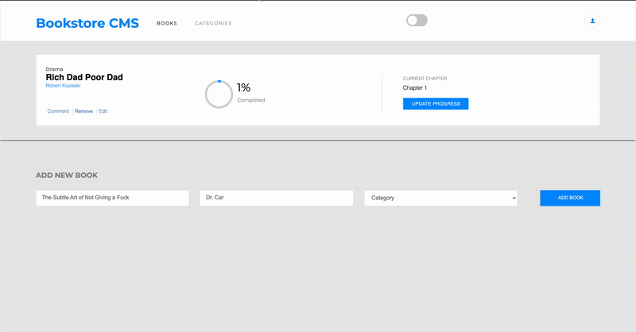

# BookStore - CMS



[DEMO - netlify](https://clinton-bookstoremvp.netlify.app)

> Welcome to BookStore, an MVP version of a BookStore app that allows you to display a list of books, add a book, remove a selected book from the list, and update your progress as you read the book. Built with React, HTML, CSS, and JavaScript.


Additional description about the project and its features.

## Built With

- Major languages (HTML, CSS, JavaScript)

- Frameworks / Libraries
  ```bash
  - React Library
  ```

- Technologies used 
  
  ``` bash
  - Git(version control)
  ```


## Getting Started

To get a local copy up and running follow these simple example steps.

### Prerequisites
 - A text editor(preferably Visual Studio Code)

### Install
  -  [Git](https://git-scm.com/downloads)
  -  [Node](https://nodejs.org/en/download/)

### Usage
#### Clone this repository

```bash
$ git@github.com:clintonjosephs/BookStore.git
$ cd BookStore
```
#### Run project

```bash
$ npm install
$ npm build
$ npm start
```

#### Open page in browser
```bash
$ runs on http://localhost:3001/
```

## Author

👤 **Clinton Mbonu**

- GitHub: [@clintonjosephs](https://github.com/clintonjosephs)
- LinkedIn: [LinkedIn](https://linkedin.com/in/clinton-mbonu)

## 🤝 Contributing

Contributions, issues, and feature requests are welcome!

Feel free to check the [issues page](https://github.com/clintonjosephs/BookStore/issues).

## Show your support

Give a ⭐️ if you like this project!

## 📝 License

This project is [MIT](https://opensource.org/licenses/MIT) licensed.